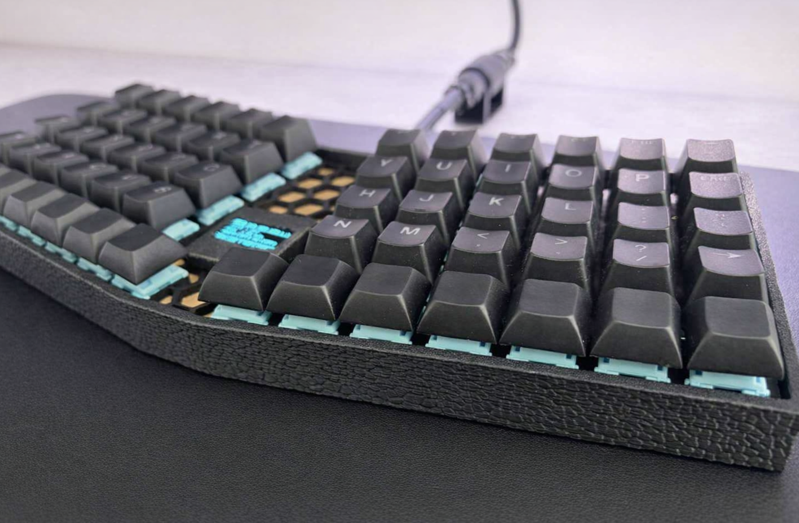
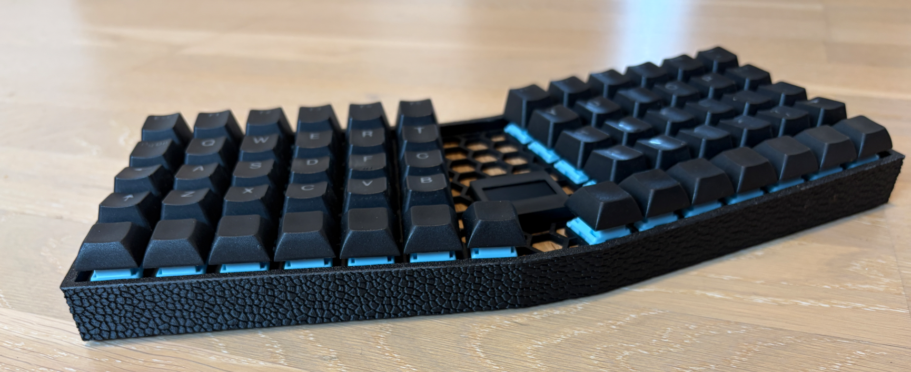
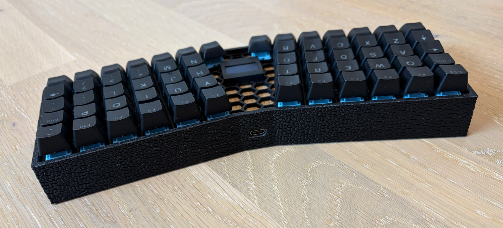
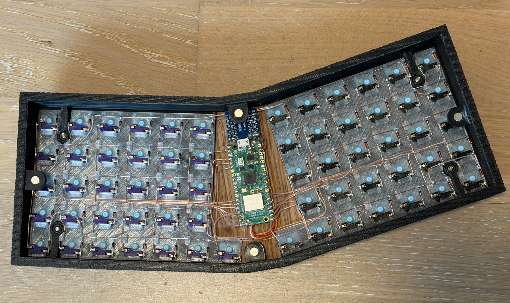
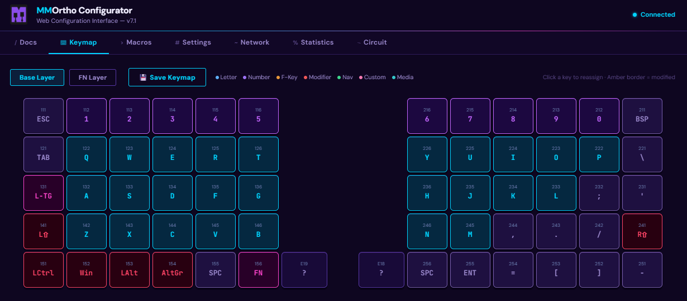
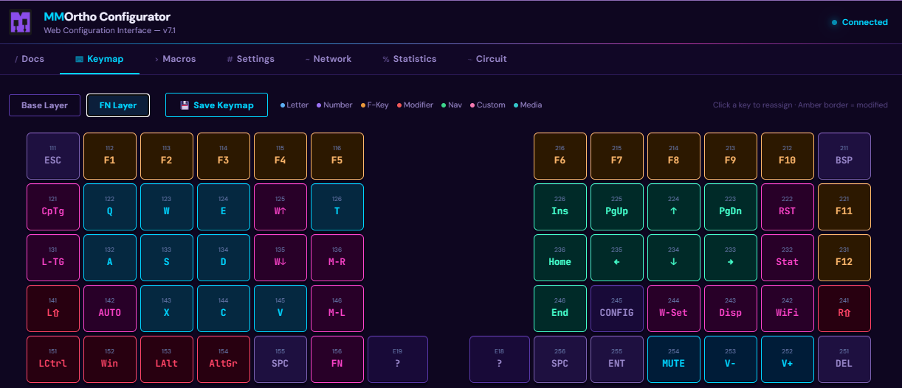
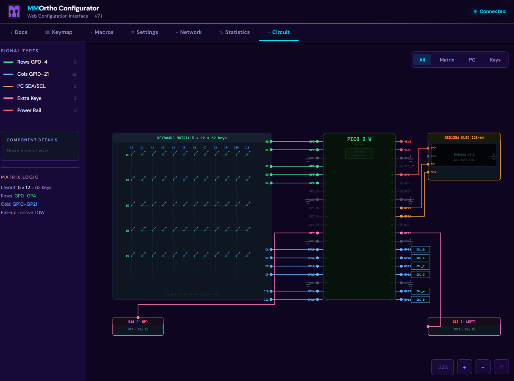

# MMOrtho

**Custom 60-key ortholinear keyboard — firmware, hardware, and web configurator**

_Raspberry Pi Pico 2 W · CircuitPython · WiFi · OLED · Browser-based config_



---

## Highlights

- **~1000 Hz scan rate** — rock-solid 9 ms debounce, zero missed keystrokes
- **128×64 OLED dashboard** — 4 live tabs: Status, System, Network, Weather
- **WiFi integrated** — NTP clock, live weather (wttr.in), Home Assistant sync
- **Macro engine** — 8 slots: text strings, key combos, mouse clicks, multi-step sequences
- **Mouse emulation** — left/right buttons, scroll, 100 Hz autoclicker, media controls
- **Web Configurator** — remap keys, edit macros, configure WiFi — all in the browser, no PC tools needed
- **Production-hardened boot** — USB drive and serial disabled by default for security
- **3D-printed case** — full Fusion 360 and STL files included

---

## Hardware

| Component | Spec                                                   |
| --------- | ------------------------------------------------------ |
| MCU       | Raspberry Pi Pico 2 W (RP2350, dual-core @ 150 MHz)    |
| Wireless  | CYW43439 2.4 GHz WiFi (onboard)                        |
| Display   | SSD1306 OLED 128×64 px via I2C                         |
| Matrix    | 5 × 12 ortholinear (60 keys) + 2 thumb keys (E18, E19) |
| Scan rate | ~1000 Hz                                               |
| Debounce  | 9 ms                                                   |

### Pin Assignments

| Signal              | GPIO                 |
| ------------------- | -------------------- |
| Matrix columns (12) | GP10–GP15, GP16–GP21 |
| Matrix rows (5)     | GP0–GP4              |
| Extra key E18       | GP9                  |
| Extra key E19       | GP22                 |
| Display SDA         | GP26                 |
| Display SCL         | GP27                 |

---

## 3D-Printed Case

MMOrtho is a **fully open-source keyboard** — the case is designed to be 3D printed at home.
All CAD files are in the [`hardware/`](hardware/) folder.

| File | Format | Use |
| ---- | ------ | --- |
| `MMOrtho.stl` | STL | Standard 3D printing (any slicer) |
| `MMOrtho.3mf` | 3MF | Pre-configured print settings included |
| `MMOrtho.step` | STEP | Import into any CAD tool |
| `MMOrtho.f3d` | Fusion 360 | Fully editable native project |

> **Tip:** Use the `.3mf` file for best results — it includes print orientation and settings.

### Bill of Materials

Everything you need to build one MMOrtho:

| Qty | Part | Notes |
| --- | ---- | ----- |
| 1 | Raspberry Pi Pico 2 W (RP2350) | The RP2350-based W variant with onboard WiFi |
| 1 | SSD1306 OLED Display 128×64 | I2C interface, 4-pin |
| 1 | USB-C Breakout Board | Wired to Pico VBUS/GND for power input |
| 62 | MX-compatible switches | 60 matrix + 2 thumb keys (E18/E19) |
| 62 | Keycaps | MX stem, any profile (e.g. XDA, DSA, OEM) |
| 4 | M3 × 10 mm screws | Case assembly |
| 4 | M3 hex nuts | Case assembly |
| 1 | 3D-printed case | Print from `hardware/MMOrtho.3mf` |

---

## Key Layout

### Base Layer

```
┌────┬───┬───┬───┬───┬───┐           ┌───┬───┬───┬───┬───┬────┐
│ESC │ 1 │ 2 │ 3 │ 4 │ 5 │           │ 6 │ 7 │ 8 │ 9 │ 0 │BSP │
├────┼───┼───┼───┼───┼───┤           ├───┼───┼───┼───┼───┼────┤
│TAB │ Q │ W │ E │ R │ T │           │ Y │ U │ I │ O │ P │ \  │
├────┼───┼───┼───┼───┼───┤           ├───┼───┼───┼───┼───┼────┤
│LTG │ A │ S │ D │ F │ G │           │ H │ J │ K │ L │ ; │ '  │
├────┼───┼───┼───┼───┼───┤           ├───┼───┼───┼───┼───┼────┤
│SFT │ Z │ X │ C │ V │ B │           │ N │ M │ , │ . │ / │SFT │
├────┼───┼───┼───┼───┼───┼───────────┼───┼───┼───┼───┼───┼────┤
│CTL │WIN│ALT│AGR│SPC│FN │ E19   E18 │SPC│ENT│ ^ │ = │ [ │ ]  │
└────┴───┴───┴───┴───┴───┴───────────┴───┴───┴───┴───┴───┴────┘
```

### FN Layer (hold FN)

| Shortcut     | Action                   | Shortcut   | Action            |
| ------------ | ------------------------ | ---------- | ----------------- |
| FN + I/K/J/L | Arrow keys               | FN + W     | WiFi toggle       |
| FN + R / F   | Scroll up / down         | FN + ,     | WiFi Setup Wizard |
| FN + B / G   | Mouse left / right click | FN + .     | Cycle OLED tab    |
| FN + A       | Autoclicker toggle       | FN + [ / ] | Volume down / up  |
| FN + M       | Mute                     | FN + P     | System reset      |
| FN + O       | Page Up                  | FN + ;     | Show statistics   |
| FN + E18     | Web Configurator         |            |                   |

---

## OLED Dashboard

Switch tabs with **FN + .**

| Tab     | Content                                                   |
| ------- | --------------------------------------------------------- |
| **STS** | KPM, uptime, Caps Lock, autoclicker state, WiFi, CPU temp |
| **SYS** | Live bars — CPU temp, voltage, scan rate                  |
| **NET** | WiFi signal, Home Assistant entity states                 |
| **WTR** | NTP clock with auto-DST + local weather from wttr.in      |

---

## Boot Modes

| Mode        | Trigger             | USB Drive | USB Serial | HID |
| ----------- | ------------------- | --------- | ---------- | --- |
| Production  | Normal plug-in      | Off       | Off        | On  |
| Development | Hold E18 at plug-in | On        | On         | On  |

> **Note:** Never use Development mode in public — the full firmware filesystem is exposed via USB mass storage.

---

## Macro Engine

Create macros in the Web Configurator and assign them to any key (M1–M8).

| Type         | Description                                              |
| ------------ | -------------------------------------------------------- |
| **Text**     | Types a string character by character                    |
| **Combo**    | Presses multiple keys simultaneously (e.g. Ctrl+Shift+T) |
| **Mouse**    | Fires a mouse button click or scroll action              |
| **Sequence** | Multi-step: mix text, combos, mouse actions, and delays  |

---

## Web Configurator

Activate with **FN + M** (WiFi must be connected).
Open the IP shown on the OLED in any browser on the same network.

| Tab        | What you can do                               |
| ---------- | --------------------------------------------- |
| Docs       | Full documentation rendered live              |
| Keymap     | Remap all keys across Base and FN layers      |
| Macros     | Create, edit, delete macros — all 4 types     |
| Settings   | Timing, Home Assistant, weather, NTP timezone |
| Network    | Scan and connect to WiFi networks             |
| Statistics | All-time keypresses, runtime, KPM, IP address |

---

## Power Management

| Level         | Trigger      | Effect                      |
| ------------- | ------------ | --------------------------- |
| Display sleep | 210 s idle   | OLED turns off              |
| Deep idle     | 30 min idle  | WiFi off, scan rate reduced |
| Wake          | Any keypress | Instant full restore        |

---

## Repository Structure

```
MMOrtho/
├── firmware/               # CircuitPython source code
│   ├── boot.py             # Boot mode selector
│   ├── code.py             # Main entry point & async event loop
│   ├── config.py           # Hardware pins, timing, API config
│   ├── keymap.py           # QMK-style layer definitions
│   ├── i2cdisplaybus.py    # Display bus compatibility wrapper
│   ├── features/           # Modular feature system
│   │   ├── keyboard.py     # Matrix scanning engine
│   │   ├── display.py      # OLED dashboard (4 tabs)
│   │   ├── macros.py       # Macro engine
│   │   ├── webserver.py    # HTTP server + REST API
│   │   ├── wifi.py         # WiFi, NTP, weather, Home Assistant
│   │   ├── mouse.py        # Mouse emulation & autoclicker
│   │   ├── power.py        # Power management & sleep
│   │   └── storage.py      # JSON-based persistent statistics
│   └── web/
│       └── index.html      # Web Configurator (single-page app)
│
├── hardware/               # 3D CAD files
│   ├── MMOrtho.3mf         # 3MF — optimized for 3D printing
│   ├── MMOrtho.stl         # STL — standard 3D printing format
│   ├── MMOrtho.step        # STEP — CAD-agnostic exchange format
│   └── MMOrtho.f3d         # Fusion 360 native project
│
├── libs/                   # CircuitPython library dependencies
│   └── (adafruit libraries — copy to CIRCUITPY/lib/)
│
├── images/                 # Product photos
│
└── docs/
    ├── SETUP.md            # Step-by-step installation guide
    └── TROUBLESHOOTING.md  # Common issues and fixes
```

---

## Getting Started

See [docs/SETUP.md](docs/SETUP.md) for the full installation guide.

**Quick summary:**

1. Flash CircuitPython to Pico 2 W
2. Copy `libs/` → `CIRCUITPY/lib/`
3. Copy `firmware/` contents → `CIRCUITPY/`
4. Edit `config.py` with your Home Assistant URL/token and city
5. Plug in — keyboard is ready
6. Use **FN + ,** to connect WiFi via the interactive wizard

---

## Photos

<table>
<tr>
<td></td>
<td></td>
</tr>
<tr>
<td></td>
<td></td>
</tr>
<tr>
<td></td>
<td></td>
</tr>
<tr>
<td colspan="2" align="center"></td>
</tr>
</table>

---


## License

MIT License — see [LICENSE](LICENSE) for details.

Developed by **Bad Habit**
